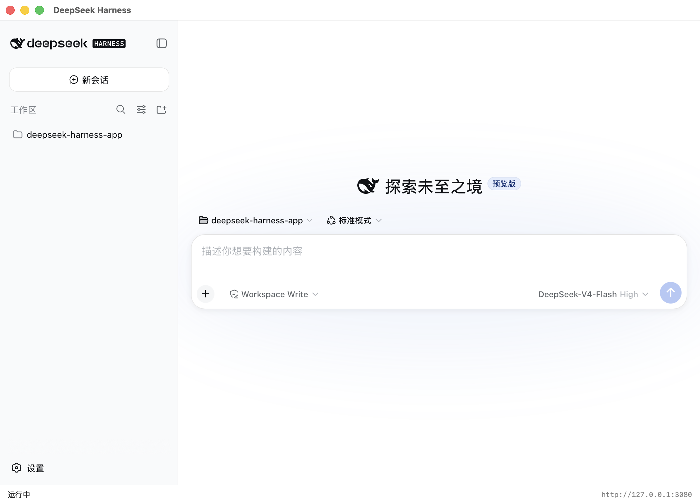

# DeepSeek Harness 桌面版

[English](README.md) | 中文

本仓库将 [DeepSeek Harness](https://github.com/deepseek-ai/deepseek-harness)（`dsh`）封装为原生桌面应用。它是 `deepseek-ai/deepseek-harness` 的 fork，在未改动的 Web 运行器之上增加了一层应用外壳：每个平台的外壳启动 `dsh web`，以内嵌 Web 视图呈现同一套 UI，并接管服务器进程——退出应用时终止服务器并释放端口。



## 应用

| 平台 | 外壳 | 发布包 |
|---|---|---|
| macOS | [apps/macos](apps/macos/README.md) — Swift + WKWebView | `DeepSeek-Harness-<version>-macos-universal.zip`（arm64 + x86_64） |
| Windows | [apps/windows](apps/windows/README.md) — C# .NET Framework + WebView2 | `DeepSeek-Harness-<version>-windows-x64.zip` |

两个外壳提供相同的行为：程序坞/任务栏图标、内嵌 UI 窗口、退出时保证清理、单实例限制、崩溃后回收孤儿服务器进程，以及显式的"在浏览器中打开"（不会自动打开系统浏览器）。

## 特性

- **自包含分发** —— macOS 的 `--bundle-dsh` / Windows 的 `-BundleDsh` 将 `@deepseek-ai/dsh` 内嵌进应用；两个构建同时捆绑 Node.js 运行时（`bin/node`，由 `NODE_BUNDLE_VERSION` 固定，默认 `v24.12.0`），无需系统安装 Node。捆绑的运行时已裁剪为 `dsh web` 所需内容（不含 npm/npx/corepack 与文档）。
- **本地化界面** —— macOS 菜单栏、右键菜单及系统提供项（撤销/重做、听写、表情与符号）跟随应用的有效语言（通过 `CFBundleDevelopmentRegion`/`CFBundleLocalizations` 声明 `zh-Hans`）；Windows 外壳本地化自身的字符串与右键菜单。
- **Windows 高 DPI** —— PerMonitorV2 清单（`apps/windows/app.manifest`）让内嵌 UI 在高分屏上保持清晰。
- **品牌图标** —— macOS 的 `AppIcon.icns` 与 Windows 的 `app.ico` 共用 DeepSeek 标识：白色标识以 70% 缩放置于 `#0d1526` 圆角方形内，与官方应用图标布局一致。
- **保证端口释放** —— 所有退出路径都会终止服务器的进程组/进程树，并在退出前确认端口已释放。

## 运行

下载对应平台的发布包 zip 后直接打开应用即可——外壳会解析 `dsh` 与 `node`（先找捆绑安装，再找 PATH），并启动内嵌 UI。从仓库检出构建应用的方法见[构建](#build)。

### 从源码运行

按[构建](#build)的说明构建外壳，然后运行产物：macOS 为 `apps/macos/build/DeepSeek Harness.app`，Windows 为 `apps/windows/build/DeepSeek Harness.exe`。

## <a id="build"></a>构建

要求：macOS 需要 `swiftc`（Xcode 命令行工具）；Windows 需要 `.NET Framework 4.x`（`csc.exe`）；捆绑需要 Node.js 24。

```sh
# macOS — apps/macos/build/DeepSeek Harness.app
apps/macos/build.sh --universal --bundle-dsh

# Windows — apps/windows/build/DeepSeek Harness.exe
powershell -ExecutionPolicy Bypass -File apps/windows/build.ps1 -BundleDsh
```

`DSH_BUNDLE_VERSION`（Windows 用 `-DshVersion`）选择要内嵌的 `@deepseek-ai/dsh` 版本；`NODE_BUNDLE_VERSION` 固定捆绑的 Node。macOS 上 `CODESIGN_IDENTITY` 选择签名身份（默认 ad-hoc `-`）；`--install` 将成品 app 复制到 `/Applications`。

## 发布

`.github/workflows/app-release.yml` 在每次 pull request 与 master 推送时构建两个平台的应用作为打包检查；推送 `dsh-v*` 标签时，将 zip 附件上传到对应 GitHub Release。内嵌版本取自标签（`dsh-v<version>`），因此发布构建前必须已发布 npm 包 `@deepseek-ai/dsh@<version>`。

`.github/workflows/upstream-sync.yml` 按 6 小时计划自动完成整个循环：将上游 `deepseek-ai/deepseek-harness` 的 master 合并进本 fork 的 master，向 npm 查询当前 `@deepseek-ai/dsh` 版本；当该版本尚无对应 Release 时，将合并后的树打上 `dsh-v<version>` 标签，从而触发发布构建。`sync_only` 手动触发只合并、不动 Release。

## 配置

两个外壳都按相同顺序解析 `dsh` 与 `node`：显式路径、应用旁的捆绑安装、然后是 PATH 风格搜索。行为按平台配置：

- macOS：`ai.deepseek.harness` 域中的偏好设置 —— `defaults write ai.deepseek.harness port -int 8080`
- Windows：`HKCU\Software\DeepSeek Harness` 下的注册表值 —— `reg add HKCU\Software\DeepSeek Harness /v port /t REG_DWORD /d 8080`

键：`port`（默认 `3080`）、`dshPath`、`nodePath`、`openBrowserOnLaunch`、`stateDir`。

## 日志与状态

外壳在应用数据目录旁保存自己的锁文件与服务器日志；`~/.dsh`（macOS）/ `%USERPROFILE%\.dsh`（Windows）保存服务器自身的 profile、会话与设置，外壳不触碰。确切的路径与卸载步骤见各外壳的 README。

## 测试

`apps/macos/scripts/test-lifecycle.sh` 与 `apps/windows/scripts/test-lifecycle.ps1` 在测试端口上端到端验证生命周期：正常退出释放端口并终止服务器的进程组/进程树；强杀后遗留的孤儿服务器由下次启动回收。

## 许可证

[MIT](LICENSE)
